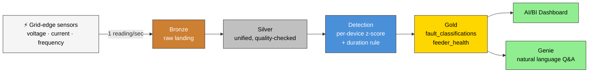
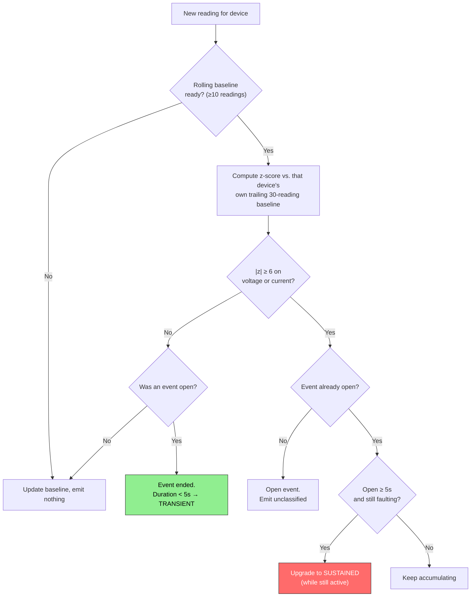
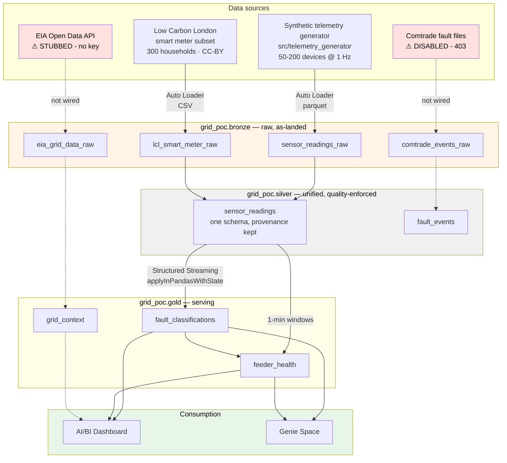

# Grid Reliability Accelerator — Databricks POC

Real-time grid-edge fault detection for electric utilities, built on Databricks
(Delta Lake, Unity Catalog, Structured Streaming, Lakeflow Declarative Pipelines,
AI/BI dashboards, Genie).

Sales-enablement proof-of-concept for a Databricks consulting partner. Built per
[`CLAUDE_CODE_BUILD_PROMPT.md`](CLAUDE_CODE_BUILD_PROMPT.md), which remains the
source of truth for requirements.

**Live workspace:** `https://dbc-d79ec249-6e44.cloud.databricks.com` · catalog `grid_poc`
**Repo:** https://github.com/drdhavaltrivedi/grid-reliability-accelerator-poc

---

## 1. The problem

Electric distribution utilities — especially **rural electric cooperatives and
municipal utilities**, the ICP for this POC — face a specific, expensive problem:

| Fact | Consequence |
|---|---|
| Up to **80%** of distribution faults occur on unmonitored/under-protected laterals at the grid edge | The utility often doesn't know a fault happened until a member calls it in |
| Roughly **70%** of those faults are **transient** (a branch brushing a line, an animal, a lightning-induced flashover) — they self-clear in seconds | Most faults need *no* crew response at all |
| The remaining ~30% are **sustained** — they need a truck | But without telemetry you can't tell which is which |

So crews get dispatched for faults that already cleared themselves. Each
unnecessary truck roll costs money and, more critically for a co-op, **consumes
scarce crew capacity across a large rural service territory** — capacity that
isn't available for the sustained fault happening 40 miles away.

**Why this segment specifically:** enterprise fault-detection point solutions
(GE, Siemens, ABB, Sense) are priced for large investor-owned utilities. Co-ops
and municipals have the same physics problem and a fraction of the budget. That
gap is the commercial opening this POC is built to demonstrate.

## 2. The solution

Distinguish **transient** from **sustained** in near-real-time, on a governed
lakehouse, so the dispatch decision is data-driven instead of reflexive.



**The demo moment:** a stakeholder watches a fault get injected live, sees it
detected and classified within seconds on the dashboard, then asks Genie a
plain-English question about it — and the answer comes from the *same* Unity
Catalog tables driving the dashboard. One governed data model, not three
disconnected tools.

### How the classification actually works

Rather than a black box, the rule is deliberately explainable — which matters when
selling to a utility engineer who will ask:



Two design choices worth calling out:

1. **The baseline only updates while the device is *not* faulting.** Otherwise a
   sustained fault slowly drags its own baseline toward the fault value and the
   detector goes blind to it.
2. **Sustained is detected *in flight*, not post-hoc.** At the 5s mark, while the
   fault is still active, it upgrades — that's what makes a live demo compelling
   rather than a retrospective report.

## 3. Architecture



Dotted lines = declared but not carrying data (see [Known gaps](#7-known-gaps--open-items)).

### The ELT flow, step by step

| # | Stage | What happens | Where |
|---|---|---|---|
| 1 | **Generate** | Telemetry generator emits one reading per device per second; a fault can be injected on demand via CLI or a control file | `src/telemetry_generator/` |
| 2 | **Land** | Parquet micro-batches written to a Unity Catalog Volume | `/Volumes/grid_poc/bronze/landing/` |
| 3 | **Extract → Bronze** | Auto Loader (`cloudFiles`) incrementally ingests new files; **explicit schemas** so the pipeline starts cleanly on an empty directory | `pipelines/10_bronze_ingestion.py` |
| 4 | **Transform → Silver** | Type casting, quality expectations (`@dlt.expect_or_drop`), ground-truth columns dropped, synthetic + LCL unioned into one schema with `source` provenance | `pipelines/20_silver_transform.py` |
| 5 | **Detect** | Per-device stateful streaming z-score + duration rule → transient/sustained | `pipelines/30_fault_detection_stream.py` |
| 6 | **Aggregate → Gold** | 1-minute per-feeder health windows joined to fault counts | `pipelines/40_gold_serving.py` |
| 7 | **Serve** | Dashboard tiles + Genie NL questions, both over gold only | `docs/dashboard_plan.md`, `docs/genie_space.md` |

Full column-level schemas: **[`docs/data_dictionary.md`](docs/data_dictionary.md)**.

### Why the LCL data is handled carefully

Low Carbon London is household **consumption** data (kWh per half-hour) — it has no
voltage, current, or frequency. To fit the unified schema, a current-like value is
*derived* (`I = kWh/hh × 2000 / 230V`). That's a real modelling decision with a
real risk of being mistaken for measured grid telemetry, so it's fenced off:

- tagged `source = 'lcl'`
- assigned a distinct `feeder_lcl_reference` feeder namespace, so it **cannot**
  silently blend into real feeder rollups
- frequency left at the UK grid's true **50 Hz** rather than faked to 60 Hz —
  fabricating a plausible-looking value would be worse than an honest mismatch
- gold aggregations filter to `source = 'synthetic'`

## 4. What's deployed and working

| Component | Status |
|---|---|
| Unity Catalog `grid_poc` + bronze/silver/gold schemas | ✅ Created |
| UC Volumes (landing zones, checkpoints) | ✅ Created |
| GitHub repo → Databricks Repo | ✅ Synced |
| LCL sample data (1.3M rows) uploaded | ✅ Uploaded |
| Seed telemetry (1,250 readings, incl. an injected fault) landed | ✅ Uploaded |
| Telemetry generator | ✅ Built, 4/4 tests pass |
| Fault detector (statistical) | ✅ Built, 3/3 tests pass |
| **Bronze pipeline** | ✅ **Runs successfully** |
| **Silver pipeline** | ✅ **Runs successfully** |
| Gold pipeline | 🔄 Deploying |
| Fault detection streaming job | ⏳ Pending |
| Dashboard + Genie | ⏳ Pending |
| Two clean dry runs | ⏳ Pending |

**Verified row counts in the live workspace** (queried 2026-08-15):

| Table | Rows |
|---|---|
| `bronze.sensor_readings_raw` | 1,250 |
| `bronze.lcl_smart_meter_raw` | 1,308,280 |
| `silver.sensor_readings` | **1,309,524** |
| ↳ `source = 'synthetic'` | 1,250 |
| ↳ `source = 'lcl'` | 1,308,274 |

The 6-row LCL difference between bronze and silver is the quality expectation
working as intended — those rows carry the literal string `"Null"` in the kWh
column and are dropped by `@dlt.expect_or_drop`.

**Local test suites** (no Databricks needed):
```bash
python tests/test_generator.py   # 4/4 pass
python tests/test_detector.py    # 3/3 pass
```

## 5. Key decisions and deviations from the spec

Every one of these is a place where reality diverged from the build spec. They are
recorded here rather than silently absorbed.

| # | Spec said | Reality | Resolution |
|---|---|---|---|
| 1 | Clone `databricks-industry-solutions/grid-edge-analytics` | **That repo does not exist** (404) | Found `comtrade-accelerator` — same domain, matches the description. Confirmed with the user before substituting. |
| 2 | Run the accelerator's Comtrade sample data | Bucket returns **403 Forbidden**, verified *both* locally and **from inside Databricks** (anonymous credentials, no instance profile) | Comtrade ingestion **disabled**, not left as a silently-failing table. Real implementation preserved as comments. |
| 3 | Adapt the Grid-Edge CNN for fault classification | The CNN consumes **726-sample high-resolution waveform captures**; our stream is 1 reading/sec SCADA-style telemetry — a **different data modality**. Plus its training data is behind the 403 above. | Statistical detector (Hard Constraint #2's documented fallback) is the **sole** detector. Flagged explicitly, not silently downgraded. |
| 4 | CNN outputs fault classification | Accelerator's gold table emits a continuous `fault_score`, **not** a transient/sustained label | Duration-based rule layered on the detector produces the actual `fault_type` the spec's schema requires |
| 5 | Use `digital-twin`'s `line_data_generator` as the pattern | That repo evolved into a manufacturing Zerobus/RDF/Lakebase system; the generator is manufacturing-domain and depends on `mandrova` (not on PyPI) | Used as an **architectural pattern only** (seeded per-entity generation, configurable noise, on-demand anomaly injection); reimplemented for grid fields with no exotic dependencies |
| 6 | EIA Open Data API for regional context | Requires key registration | **Stubbed** at user's direction. Tables declared so the shape is documented; they return zero rows rather than pretending. |
| 7 | Ingest LCL smart meter data | Full dataset is ~167M rows | Subset to 300 households × 3 months (1.3M rows, 0.8%) per Hard Constraint #2 |
| 8 | `gold.fault_classifications` with 4 columns | Demo narrative needs device-level drill-down | Added `device_id`. Documented in the data dictionary. |

## 6. Deployment log

Real errors hit while deploying, and how each was resolved — kept because they're
the non-obvious parts someone repeating this will also hit:

| Error | Cause | Fix |
|---|---|---|
| `PIP_INSTALL_NOT_AT_TOP_OF_NOTEBOOK` | A literal `%pip install` **inside a Python comment** was parsed as a real magic cell | Reworded the comment |
| `NameError: SENSOR_READINGS_LANDING_PATH` | `%run "./00_config"` variables don't reliably propagate into DLT's execution model | Inlined config constants into each pipeline notebook |
| `CF_EMPTY_DIR_FOR_SCHEMA_INFERENCE` | Auto Loader can't infer a schema from an empty landing dir — exactly the state after `demo_runner.py reset` | Declared **explicit schemas**; also removes a demo-day failure mode |
| `DELTA_INVALID_CHARACTERS_IN_COLUMN_NAMES` | LCL's real header is `KWH/hh (per half hour) ` — spaces and parens are illegal in Delta column names | Renamed to `kwh_per_half_hour` at ingest |
| Catalog creation via CLI rejected | Free Edition uses Default Storage; the catalog API wants an explicit `MANAGED LOCATION` | Created via SQL statement API instead |
| `PARQUET_COLUMN_DATA_TYPE_MISMATCH` | **A real demo-breaking bug.** pyarrow types an all-`None` column as parquet `null`, not `string` — so batches *with* an injected fault had a different schema than normal batches. It would have failed at exactly the moment a fault was triggered in front of a prospect. | `ParquetSink` now writes with an explicit fixed `pa.schema(...)` |
| `FileNotFoundException` on a landing file | Auto Loader's checkpoint still referenced files deleted during re-seeding | `start-update --full-refresh` (note: the flag is `--full-refresh`, not `--full-refresh-all`) |
| `STREAMING_FROM_MATERIALIZED_VIEW` | `silver.fault_events` tried to stream from the disabled Comtrade stub, which is a batch materialized view | Switched that read to `spark.read.table` |

### Why there were so many of these

The pipeline code was written **before** workspace access existed (per the original
"build locally first" decision), so ~2,400 lines of Spark/DLT went unexecuted until
deployment day. The README flagged it as unverified, but flagging isn't preventing —
each unvalidated assumption surfaced as its own failed run. If repeating this:
use `databricks pipelines start-update --validate-only` to surface errors in batch
instead of one run at a time.

## 7. Known gaps / open items

Nothing below is hidden in a footnote — these are the honest limits of the POC as
it stands:

- **Comtrade / CNN path is dead**, not deferred. Confirmed inaccessible from inside the workspace. Reviving it needs a legitimately accessible waveform dataset.
- **EIA is stubbed.** `gold.grid_context` exists and returns zero rows. Needs an API key.
- **`applyInPandasWithState` state serialization** (`pipelines/30_fault_detection_stream.py`) is the least-proven code in the repo — pickling detector state into Spark's `BINARY` state columns. Written carefully, needs a real run to trust.
- **Dashboard JSON is a 2-tile skeleton.** The remaining 3 tiles from `docs/dashboard_plan.md` need building in the Lakeview UI; hand-writing that JSON blind was judged too error-prone.
- **Two clean dry runs not yet done.** Per the spec's Definition of Done, the demo isn't demo-ready until they are.
- **`confidence_score` is a heuristic** (`min(1, peak_z / 20)`), not a calibrated probability. Fine for a demo; don't let a prospect read it as a real confidence interval.
- **Cost:** everything runs on serverless / 2X-Small. The accelerator's own default was a 5-worker cluster — deliberately not copied (Hard Constraint #4).

## 8. Public data sources

Everything here is real, public, and citable — no customer or prospect data, per
Hard Constraint #1. Availability re-verified 2026-08-15.

| Source | Size | Credentials | Licence / terms | Used for |
|---|---|---|---|---|
| [Low Carbon London smart meter data](https://data.london.gov.uk/dataset/smartmeter-energy-use-data-in-london-households) | 759 MB zip (168 blocks) | **None** — direct download | CC-BY | ✅ **In use.** 300 households × 3 months subset (1.3M rows) for consumption-shape realism |
| [EIA Open Data — bulk archives](https://api.eia.gov/bulk/EBA.zip) | ~650 MB | **None** — the bulk endpoint needs no API key, unlike the v2 REST API | US Gov public domain | ⭐ **Available, not yet wired.** Would un-stub `gold.grid_context` without needing the key registration the spec assumed |
| [Open Power System Data — 60-min time series](https://data.open-power-system-data.org/time_series/latest/time_series_60min_singleindex.csv) | 124 MB | **None** | CC-BY 4.0 | Candidate: real European grid load/generation, hourly |
| [UCI Individual Household Electric Power Consumption](https://archive.ics.uci.edu/dataset/235/individual+household+electric+power+consumption) | ~2M rows | **None** | CC-BY 4.0 | Candidate: 1-minute-resolution real household load — closer to our stream's cadence than LCL's half-hourly |
| Comtrade fault files (`s3://db-gtm-industry-solutions/...`) | — | **Blocked** | — | ❌ **403 Forbidden**, confirmed from inside Databricks. Dead end. |

**Recommended next data step:** wire the EIA bulk archive. It's the only one that
closes a currently-open gap (`grid_context` is declared but empty), and the
no-API-key bulk endpoint removes the blocker that caused EIA to be skipped
originally.

## 9. Repo layout

```
energy/
├── CLAUDE_CODE_BUILD_PROMPT.md    the build spec (source of truth)
├── README.md                      this file
├── requirements.txt               local deps (pandas, pyarrow)
├── src/
│   ├── telemetry_generator/       Phase 2 — synthetic grid telemetry + fault injection
│   └── fault_detector/            Phase 4 — statistical z-score detector
├── pipelines/
│   ├── 00_config.py               canonical config values
│   ├── 10_bronze_ingestion.py     Auto Loader → bronze
│   ├── 20_silver_transform.py     unified silver schema
│   ├── 30_fault_detection_stream.py   stateful detection → gold
│   └── 40_gold_serving.py         feeder health aggregation
├── scripts/
│   ├── fetch_lcl_sample.py        pulls the LCL subset
│   └── demo_runner.py             reset / start / trigger / confirm
├── docs/
│   ├── data_dictionary.md         as-built schemas, every layer
│   ├── runbook.md                 setup + demo sequence + troubleshooting
│   ├── genie_space.md             5 NL questions + expected SQL
│   └── dashboard_plan.md          tile-by-tile dashboard spec
└── tests/                         standalone smoke tests
```

## 10. Running it

**Local (no Databricks):**
```bash
pip install -r requirements.txt
python tests/test_generator.py
python tests/test_detector.py

# watch a fault get injected and self-clear
python -m src.telemetry_generator run --num-devices 20 --rate 2 --duration 10 --sink console
# in another terminal:
python -m src.telemetry_generator trigger --device-id dev_0005 --fault-type sustained
```

**On Databricks:** follow [`docs/runbook.md`](docs/runbook.md).
